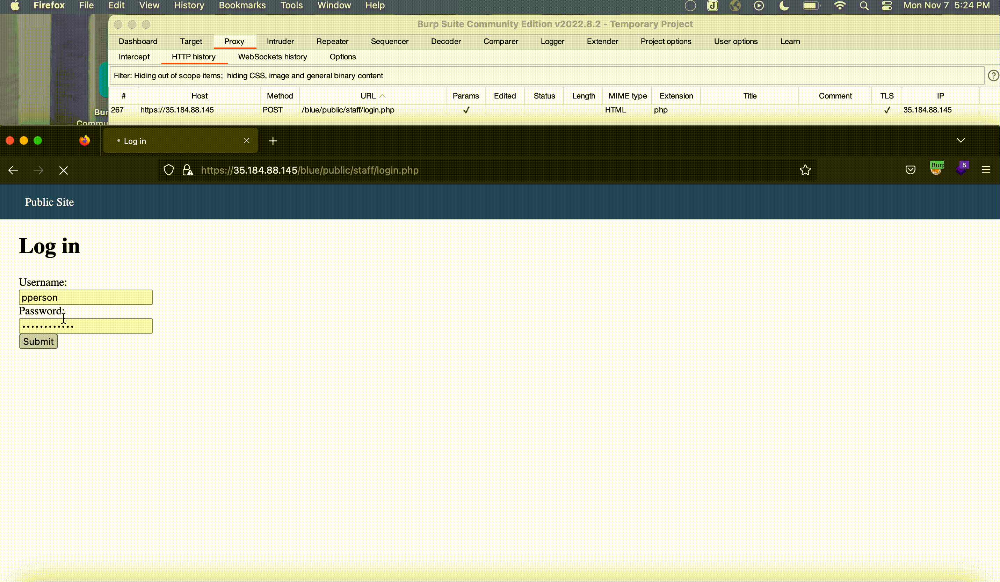
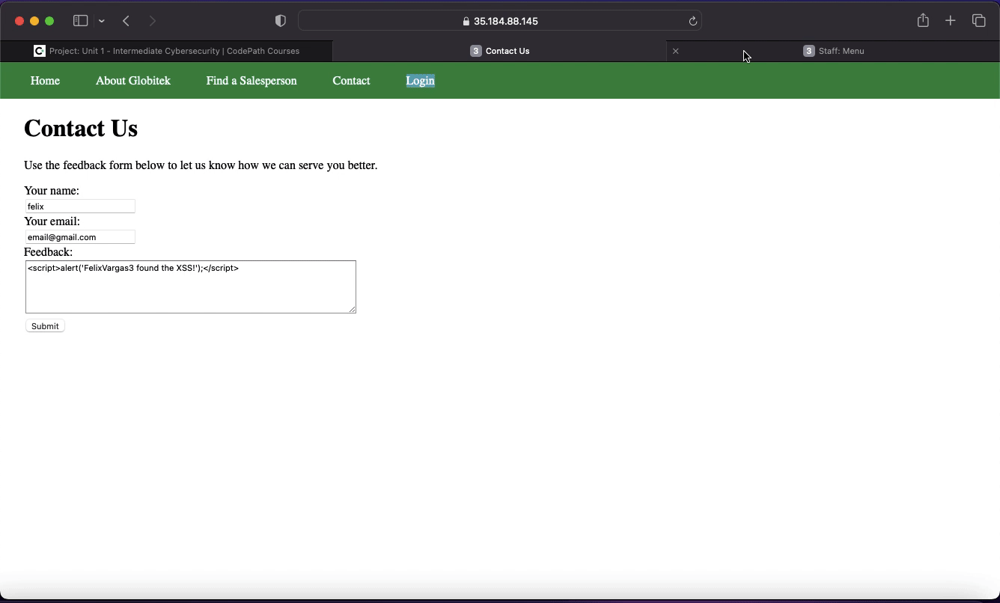
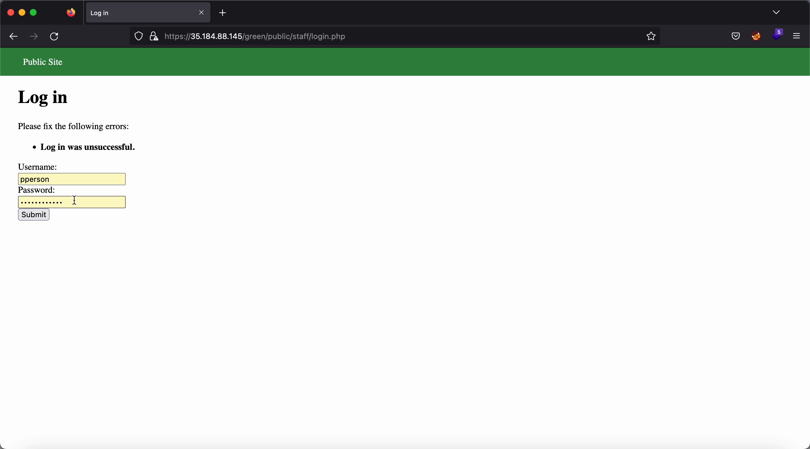
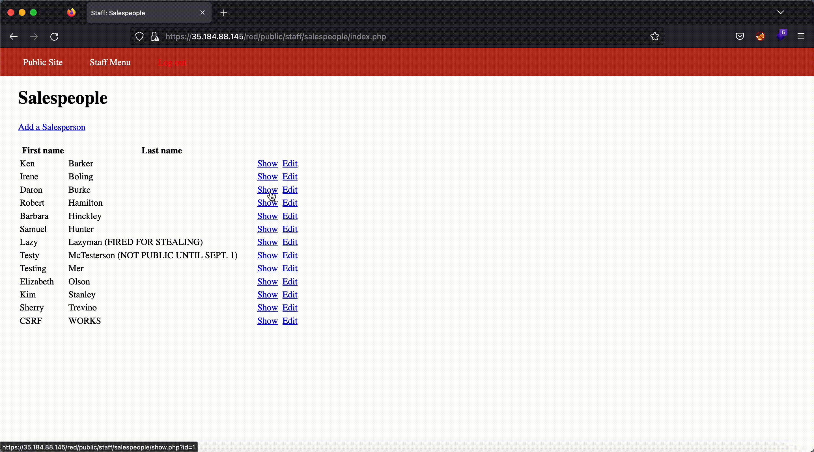

# Pen Testing Live Targets

Time spent: 15 hours spent in total

The six possible exploits are:

* Username Enumeration
* Insecure Direct Object Reference (IDOR)
* SQL Injection (SQLi)
* Cross-Site Scripting (XSS)
* Cross-Site Request Forgery (CSRF)
* Session Hijacking/Fixation

## Blue

Vulnerability #1: Session Hijacking/Fixation

Description: I logged into the blue site using Firefox and from there I checked burpe to see the session ID generated when I logged in. I then took the role of a hacker and copied the session ID and visited the website again from a Google chrome browser. Now I used a cookie manager tool to inject the cookie I stole from the othere site and was able to login without any credentials. I was able to complete a session hijacking attack with the stolen session ID.

## Green

Vulnerability #1: * Cross-Site Scripting (XSS)

Description: To complete this attack you do not need to be an actual user for the site, you would use the contact option and put your script in the comments option. You can enter a fake name and email and submit your comment with the script and wait for an admin to view the comments. Once an authorized user is logged in and checks the comments, the script will execute. 

Vulnerability #2: * Username Enumeration

Description: I noticed that when attempting to login on the green site if you logged in with the correct username but wrong password the response the site gives you is bold. BUT if you log in with the wrong username and wrong password then you get a response with normal letters that are not bold. There should be no difference in response whether the login attempt has the right username or not. 

## Red

Vulnerability #1: * Insecure Direct Object Reference (IDOR)

Description: Once logged in and looking at the salespeople for the site, we can see the id number associated with the user and change who we view based on that id number. 

