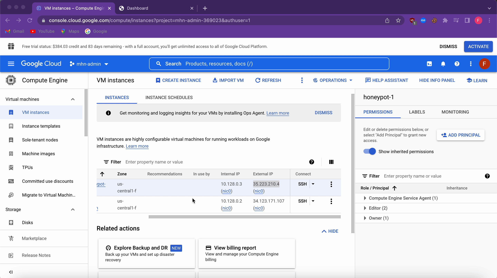

# Honeypot Assignment

**Time spent:** 15 hours spent in total

### MHN-Admin Deployment (Required)

**Summary:** How did you deploy it? Did you use GCP, AWS, Azure, Vagrant, VirtualBox, etc.?

To deploy the MHN admin for my honeynet I used GCP, or Google Cloud Platform, because all the instructions I found for this assignment used that platform. So to use this platform I had to create a free account and then download and install the Google Cloud CLI to work on creating my VM from my local terminal. You have the option of using the GCP to create the VM if you want a GUI, or you can use the terminal and feed it commands to create your VM. I also use the terminal and command line to create firewall rules for what we do or do not wanna allow. The last step was to establish SSH access to the MHN admin VM from the command line

### Dionaea Honeypot Deployment (Required)

**Summary:** Briefly in your own words, what does dionaea do?

Dionaea appears to be a vulnerable Windows infrastructure and have vulnerable services running, trying to get someone to exploit these vulnerabilities. The goal of this honeypot is to capture information from the malware used to exploit the vulnerabilities during any attacks.

### Database Backup (Required) 

**Summary:** What is the RDBMS that MHN-Admin uses? What information does the exported JSON file record?

The exported Json file contains information on some of the attacks that took place on our honeypot. The information is limited to only some of the attacks because we truncated the file so it would fit the submission size. Some of the information found in this file includes the date the attack took place. You can also see information from the attacks like source IP, source port, and destination port. We are also given the protocol that was used and the identifier of what was attacked, for me it was my dionaea honeypot
